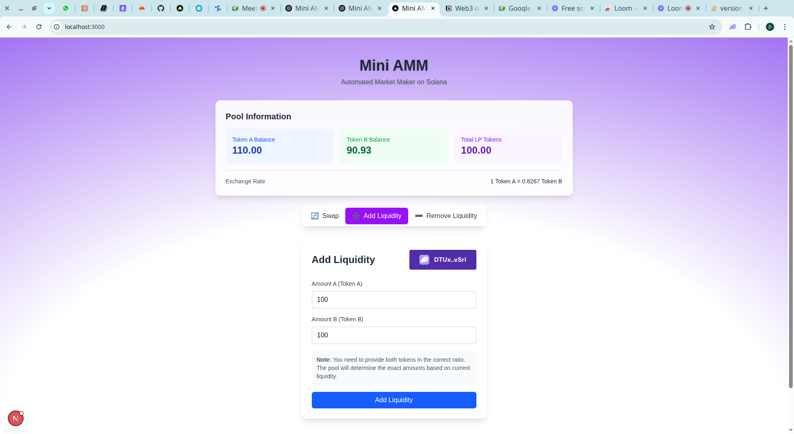
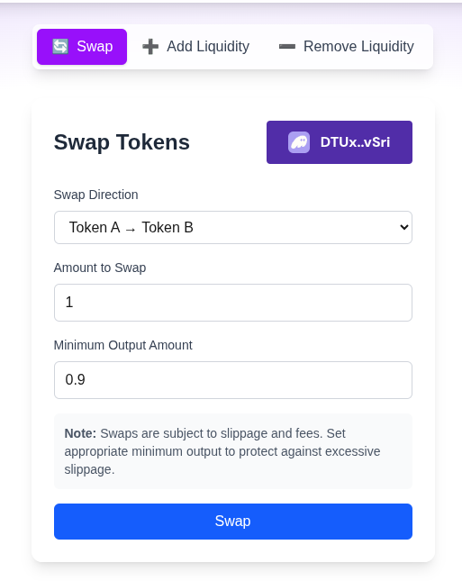
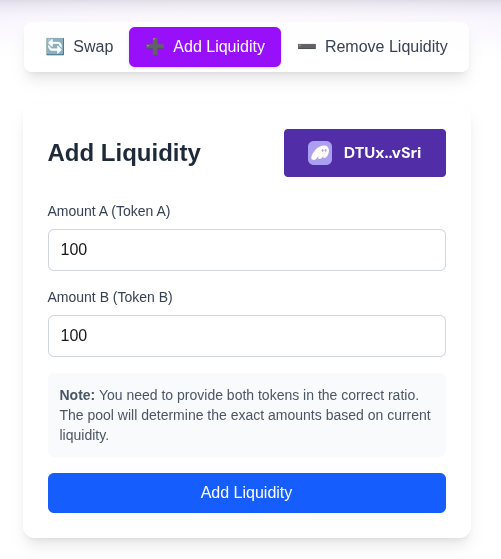
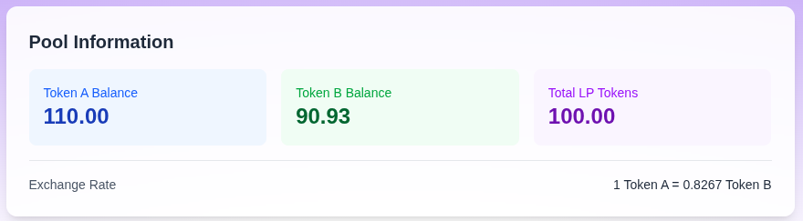

# Mini AMM - Solana Automated Market Maker

A complete decentralized Automated Market Maker (AMM) built on Solana using Anchor framework, featuring a modern Next.js frontend with flexible background theming.

## 📸 Screenshots

### Main Interface


### Swap Interface


### Add Liquidity


### Pool Information


*To add screenshots: Create a `screenshots` folder in the root directory and add your interface screenshots*

## 🎯 Features

- **Complete AMM Functionality**: Swap tokens, add/remove liquidity
- **Solana Integration**: Built with Anchor framework for high-performance on-chain operations
- **Modern Frontend**: Next.js 15 with TypeScript and Tailwind CSS
- **Real-time Pool Data**: Live pool statistics and balance tracking
- **Wallet Integration**: Seamless wallet connection with multiple wallet support
- **Flexible UI**: Glassmorphism design with customizable backgrounds
- **Responsive Design**: Works perfectly on desktop and mobile
- **Type Safety**: Full TypeScript support throughout the stack

## 🏗️ Architecture

This project is organized as a Turborepo monorepo with the following structure:

```
mini-amm/
├── apps/
│   ├── frontend/          # Next.js frontend application
│   │   ├── components/    # React components
│   │   ├── hooks/         # Custom React hooks
│   │   ├── utility/       # Utility functions
│   │   └── types/         # TypeScript type definitions
│   └── program/           # Solana program (smart contract)
│       ├── programs/      # Anchor program source
│       ├── scripts/       # Deployment and interaction scripts
│       └── tests/         # Program tests
└── packages/              # Shared packages
    ├── ui/                # Shared UI components
    ├── typescript-config/ # Shared TypeScript configs
    └── eslint-config/     # Shared ESLint configs
```

## 🚀 Quick Start

### Prerequisites

- Node.js 18+ and pnpm
- Rust and Cargo (for Solana development)
- Solana CLI tools
- Anchor CLI

### Installation

1. **Clone the repository**
   ```bash
   git clone <repository-url>
   cd mini-amm
   ```

2. **Install dependencies**
   ```bash
   pnpm install
   ```

3. **Set up Solana environment**
   ```bash
   # Configure Solana CLI for devnet
   solana config set --url devnet
   
   # Create a new keypair (if needed)
   solana-keygen new
   
   # Airdrop some SOL for testing
   solana airdrop 5
   ```

### Development

1. **Start the development servers**
   ```bash
   # Start all services
   pnpm dev
   
   # Or start specific services
   pnpm dev --filter=frontend  # Frontend only
   pnpm dev --filter=program   # Program only
   ```

2. **Build the Anchor program**
   ```bash
   cd apps/program
   anchor build
   ```

3. **Deploy the program (if needed)**
   ```bash
   cd apps/program
   anchor deploy
   ```

## 🎨 Background Customization

The frontend features a flexible background system. You can easily change the background by modifying `apps/frontend/app/page.tsx`:

### Current Background (Light Gradient)
```tsx
export default function Home() {
  return (
    <div className="min-h-screen w-full relative">
      <div
        className="absolute inset-0 z-0"
        style={{
          backgroundImage: "radial-gradient(125% 125% at 50% 90%, #fff 40%, #7c3aed 100%, transparent)",
        }}
      />
      <AMM />
    </div>
  );
}
```

### Example: Dark Purple Glow
```tsx
export default function Home() {
  return (
    <div className="min-h-screen w-full bg-[#020617] relative">
      <div
        className="absolute inset-0 z-0"
        style={{
          backgroundImage: `radial-gradient(circle 500px at 50% 100px, rgba(139,92,246,0.4), transparent)`,
        }}
      />
      <AMM />
    </div>
  );
}
```

### Example: Solana Green
```tsx
export default function Home() {
  return (
    <div className="min-h-screen w-full bg-[#0a0a0a] relative">
      <div
        className="absolute inset-0 z-0"
        style={{
          backgroundImage: `radial-gradient(circle 600px at 30% 40%, rgba(20,184,166,0.3), transparent)`,
        }}
      />
      <AMM />
    </div>
  );
}
```

## 🔧 Program Setup

### 1. Create Test Tokens

```bash
cd apps/program
node scripts/create-tokens.js
```

### 2. Initialize Pool

```bash
cd apps/program
npx ts-node scripts/initialize-pool.ts
```

### 3. Add Initial Liquidity

```bash
cd apps/program
node scripts/add-liquidity.js
```

### 4. Test Swaps

```bash
cd apps/program
node scripts/test-swap.js
```

## 📋 Available Scripts

### Root Level
- `pnpm dev` - Start all development servers
- `pnpm build` - Build all packages and apps
- `pnpm lint` - Run linting across all packages
- `pnpm clean` - Clean all build artifacts

### Frontend (`apps/frontend`)
- `pnpm dev` - Start Next.js development server
- `pnpm build` - Build the frontend for production
- `pnpm start` - Start production server
- `pnpm lint` - Run ESLint

### Program (`apps/program`)
- `anchor build` - Build the Anchor program
- `anchor deploy` - Deploy to configured network
- `anchor test` - Run program tests
- `anchor localnet` - Start local validator

## 🛠️ Configuration

### Program Configuration

The program configuration is in `apps/program/Anchor.toml`:

```toml
[programs.devnet]
mini_amm = "3i6Xy9tVvVLB5LdYeAe3irwTTdzrHRNw7MC4qijcNVBW"

[provider]
cluster = "devnet"
wallet = "~/.config/solana/id.json"
```

### Frontend Configuration

Key configuration files:
- `apps/frontend/utility/constants.ts` - Program ID and other constants
- `apps/frontend/next.config.ts` - Next.js configuration
- `apps/frontend/tailwind.config.ts` - Tailwind CSS configuration

## 🔗 Important Addresses

- **Program ID**: `3i6Xy9tVvVLB5LdYeAe3irwTTdzrHRNw7MC4qijcNVBW`
- **Token A**: `M546sKo2CSLUgadVRayVcZAKX27bQTGUWpB9Y1vSgh7`
- **Token B**: `BxjrNSGbZbkuJuuHBhjPze5YDiKEtmwHDRKajsPZiCL5`

## 🎯 Usage

### For Users

1. **Connect Wallet**: Click the wallet button to connect your Solana wallet
2. **Swap Tokens**: Use the swap interface to exchange tokens
3. **Add Liquidity**: Provide liquidity to earn fees
4. **Remove Liquidity**: Withdraw your liquidity position
5. **View Pool Stats**: Monitor real-time pool information

### For Developers

1. **Modify Program**: Edit `apps/program/programs/mini-amm/src/lib.rs`
2. **Update Frontend**: Modify components in `apps/frontend/components/`
3. **Add Features**: Extend functionality using the existing patterns
4. **Customize UI**: Change backgrounds, colors, and styling

## 🧪 Testing

### Program Tests
```bash
cd apps/program
anchor test
```

### Frontend Tests
```bash
cd apps/frontend
pnpm test
```

## 📦 Dependencies

### Frontend
- **Next.js 15** - React framework
- **@solana/wallet-adapter** - Wallet integration
- **@coral-xyz/anchor** - Solana program interaction
- **Tailwind CSS** - Styling
- **TypeScript** - Type safety

### Program
- **Anchor** - Solana development framework
- **SPL Token** - Token program integration

## 🚀 Deployment

### Program Deployment
```bash
cd apps/program
anchor build
anchor deploy --provider.cluster devnet
```

### Frontend Deployment
```bash
cd apps/frontend
pnpm build
# Deploy to your preferred hosting platform
```

## 🤝 Contributing

1. Fork the repository
2. Create your feature branch (`git checkout -b feature/amazing-feature`)
3. Commit your changes (`git commit -m 'Add some amazing feature'`)
4. Push to the branch (`git push origin feature/amazing-feature`)
5. Open a Pull Request

## 📄 License

This project is licensed under the MIT License - see the LICENSE file for details.

## 🔍 Troubleshooting

### Common Issues

1. **Wallet Connection Issues**
   - Ensure your wallet is set to Devnet
   - Check if you have sufficient SOL for transactions

2. **Program Errors**
   - Verify program is deployed correctly
   - Check program ID matches in configuration

3. **Frontend Build Issues**
   - Clear Next.js cache: `rm -rf .next`
   - Reinstall dependencies: `pnpm install`

4. **RPC Issues**
   - Switch to a different RPC endpoint
   - Check network connectivity

## 📞 Support

For questions and support:
- Open an issue on GitHub
- Check the troubleshooting section
- Review the Anchor and Solana documentation

## 🎉 Acknowledgments

- **Solana Foundation** for the excellent blockchain infrastructure
- **Anchor** framework for simplifying Solana development
- **Next.js** team for the amazing React framework
- **Tailwind CSS** for the utility-first CSS framework

---

Built with ❤️ on Solana
